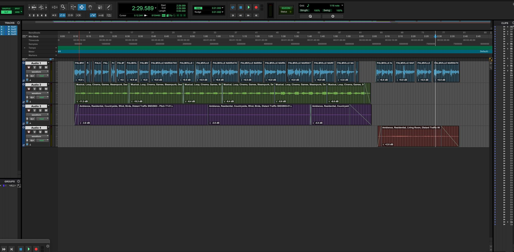
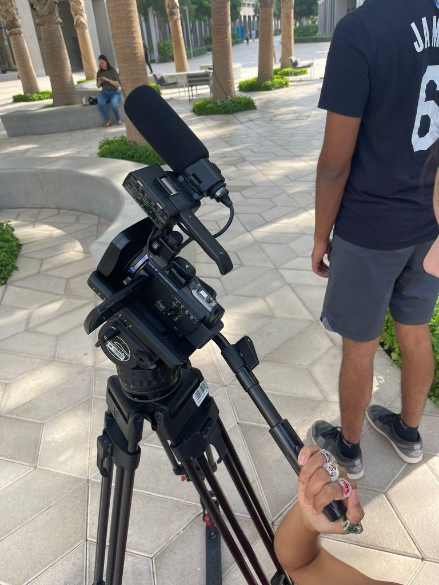
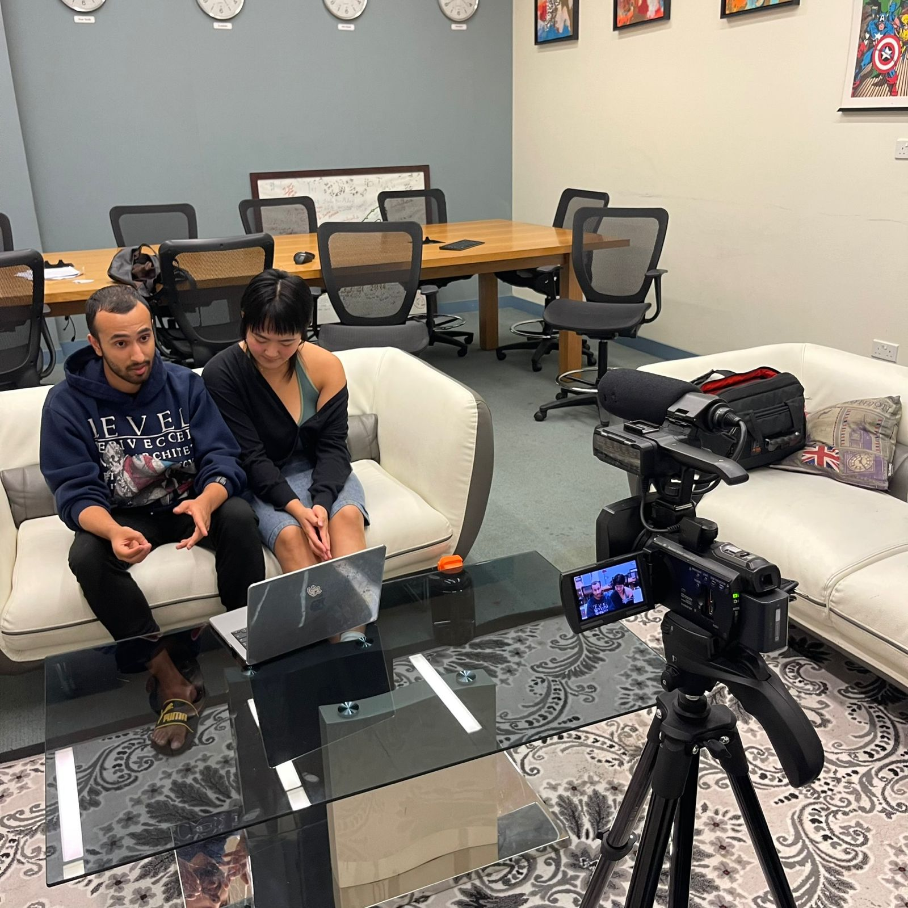
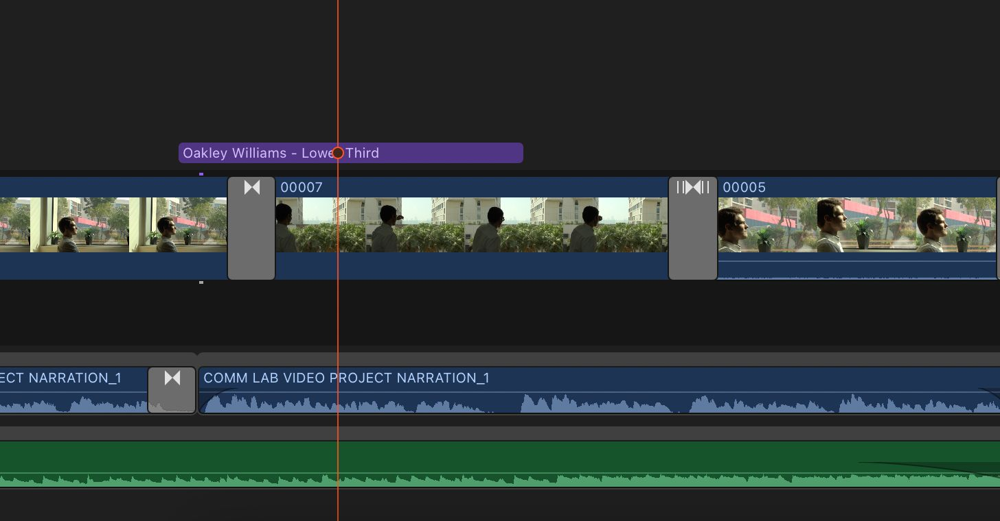
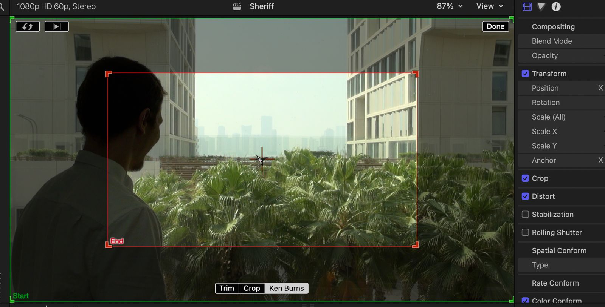
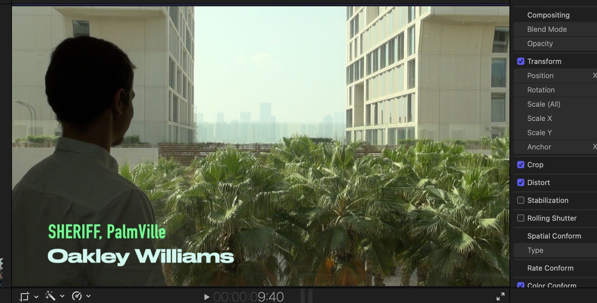
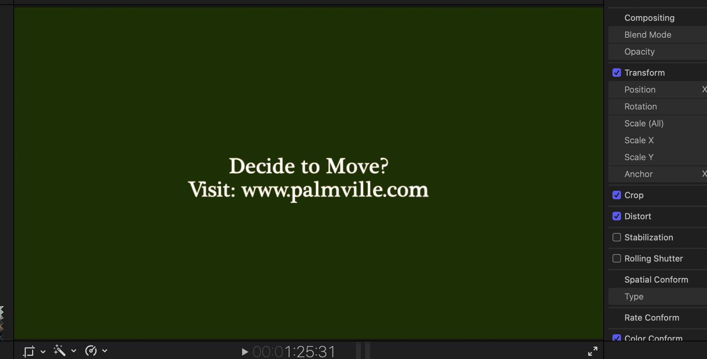

# Palmville
## Concept and Theme
This project is inspired by the option 2 of the assignment prompts. It is aimed at telling the life of the people living in a fictional community called PalmVille. This community is imagined to be high in palm trees and its surrounding is deserted. The PalmVille community is therefore a heaven, a sanctuary, and an oasis in this world. In this project, we imagine that at the end of the world, people are finding the final sanctuary of humanity, and that is PalmVille. To create this experience, we have made the website as the advertisement of this community, encouraging people to move here. The interactivity is displayed by clicking on the different residents to learn about their stories, scrolling effect, and the signup form.

The moral of the story: A heavenly community that seems to be nice, welcoming, and friendly. However, something seems to be not right here… (What is the secret behind the “no escape” rule?)

## Clips & Shot List
We have four scenes to shoot: The community environment for the introduction video, the sheriff’s interview, the restaurant owner’s interview, and the married couple’s interview. Here’s the primary shotlist of these clips:

| No. | Character | Outdoor / Indoor | Camera Movement | Description |
|-----|-----------|------------------|-----------------|-------------|
| 1   | OPENING   | Outdoor PALMS    | Zoom in         | Long shot of the environment |
| 2   | OPENING   | Outdoor AMPHITHEATER | Zoom in     | Long shot of the environment |
| 3   | Sheriff [BACKGROUND NARRATION] | Outdoor HIGHLINE D1 | Horizontal move | WIDE SHOT Sheriff looking through D1 highline glass |
| 4   | Sheriff [BACKGROUND NARRATION] | Outdoor HIGHLINE D1 | Horizontal move | CLOSE UP Side profile of sheriff looking through glass |
| 5   | Sheriff   | Outdoor AMPHITHEATER R | Steady | Interview shot: Sheriff speaks his lines |
| 6   | Sheriff / Escapee | Outdoor HIGHLINE D1 | Zoom in | Sheriff's pursuit of the escapee who is riding a scooter |
| 7   | Restaurant Owner [BACKGROUND NARRATION] | Indoor LOUNGE for restaurant | Steady | Restaurant owner preparing food |
| 8   | Restaurant Owner | Outdoor AMPHITHEATER R | Stady BBC rule | Interview shot: Restaurant owner speaks his lines |
| 9   | Married Couple [WIFE] | Indoor LOUNGE for restaurant | Zoom in | Zoom camera to this wife in the background |
| 10  | Married Couple | Indoor Someone's ROOM | Steady | The couple does something in the background show |
| 11  | Married Couple | Outdoor AMPHITHEATER R | Steady, BBC rule | Interview shot: The couple speaks their line |
| 12  | END       |                  |                 |             |

## Implementation
### Audio
We recorded the narration portion of the video, helped shoot some of the scenes, wrote part of the script, and edited the audio for the video. We recorded with the Zoom H5 recorder and edited the audio in Pro Tools. In order to support the narration, we also added in some background audio using the software Soundly. When editing the audio, we didn’t use many plug-ins since the audio was fairly clean and didn’t need much adjustment. For consistency purposes, we chopped up the audio and used fade ins and outs to create a seamless soundscape.

### Video
There are two parts of filming: 1. Environment 2. Personal interviews. The equipment used in filming is the Sony video camera that comes with a microphone and the tripod. For the environment, we took shots in some spots on campus that might represent the imagined environment of PalmVille, including the Sexton Square, Highline, and the desert outside. We mainly took static scenes for around 30 seconds with some zoomed in shots. 

For the personal interviews, they mainly took place in the Baraha study rooms for their casual, home/office like settings. We used the BBC rule introduced in class to frame the camera for the interviews. As time for each character was limited, we did not include the actual interviewers. Instead, we put the questions into the videos as subtitles.

For cutting and editing, we mainly used Final Cut Pro. There are several techniques used in this project (take the Sheriff’s clip as an example):
1. **Transition effects**:
The main transition effect used is the cross dissolve. Since we have many clips taken at different time, it is important to make the transitions smooth and natural. The cross dissolve does a good job in creating this for almost all different shot.

2. **Ken Burns Transform (Key frames)**:
We also applied Ken Burns transform to this project. It is a special case of key frames. The editing software can automatically calculate the change of the pivotal point and the scale and move the center of the camera to the desired place with the focus specified. This transform is quick, automatic and natural, and is very helpful for shifting the focus of the viewers.

3. **Preset animations and subtitles**:
We took the advantage of many Presets in Final Cut Pro. Specifically, we used the animated subtitles to make our videos more dynamic. We used the lower third subtitles for both the introduction of the characters and the interview question display and the center subtitle for the ending screen.

4. As an addition, we also took the advantage of the audio editing feature of Final Cut Pro to make simple productions on our recorded sounds. We used the noise cancellation, hum cancellation, fade-in/fade-out, and attenuation to make our sounds sound better and consistent with the videos.

### Website
The website uses a number of features to bring life to Palmville and encourage viewers to join the community. 

1. **Animations**:
Scroll Animations:
The JavaScript file defines a function scrollAnim() that adds animations to elements when they enter the viewport during scrolling by checking each element's position relative to the viewport and adding an 'active' class when the element is visible, which is what triggers the animations.
Page Load Animation:
When the page is loaded, the JavaScript file adds a 'loaded' class to the element with the class .title, which initiates an animation to make the title appear in a visually appealing way when the page is first opened.

2. **Modals (pop-up windows)**:
The project has modals for displaying videos about the residents. There are event listeners attached to buttons (like 'sheriff-btn', 'couple-btn'). When these buttons are clicked, the corresponding modal (sheriffModal, coupleModal) is displayed with a flex style, making the modal appear on the screen. When clicking outside the modal, it is closed. Also, there's code to reset the video iframe sources when closing the modals to stop video playback and reset the video timer.

3. **Form**:
The form at the end is just a placeholder for an actual form, meaning it does not actually send data anywhere. The confirmation message is set to `opacity: 0` and when the sign up button is clicked, it changes to `opacity: 1`, with a small animation for the sake of improving user experience.

4. **Header**:
The header menu is set to `position:fixed` so that it always sticks to the top. The buttons help the user navigate through the page using the scrollToOffset() function which calculates the position of the div to scroll to and adds the offset (height of the header bar). This is combined with `behavior: 'smooth'` to ensure the scrolling is smooth to improve user experience. 

## Roles and Contributions
### Diana
When working on the audio for the video, I wanted to sonically support the visuals that went along with the story of Palmville. While narrating the video, my goal was to convey a believable story for Palmville and help the audience feel as if they should live in Palmville. The main concept of the video was to advertise the small town, Palmville, which aims to grow its community over the next couple of years!
### Yupu
Primarily filmed the scenes, cut and edited the videos, helped build the website, and wrote the script and shot list together with other team members.
### Madina
Together with my teammates I worked on the shotlist and wrote the script. Also helped with filming.
### Kash
Worked on part of the script and shot list, helped film some of the scenes, and created the website.

## Reflection and Evaluations

### Diana

Brainstorming an idea took some time initially, but we were all able to agree on the final concept after the first class. We wanted to go for a light hearted pseudo-documentary that advertised the small town that we came up with known as Palmville. We based Palmville off of campus, since we knew that we needed to film primarily on campus. We then went on to pick different areas around campus to film and organized a final shot list. Once this was done, we each chose a character to write lines for and found actors to play each role. Over the following weeks, we shot footage of each character and collected our clips to prepare them for post production. Throughout the entire process, we communicated with each other to ensure the project was running smoothly and that each of us was fulfilling our roles. I really liked how our project came together in the end and enjoyed watching the final video.

### Yupu
There were some problems we had to solve during the shooting and production. For shooting, since we were limited to the campus, we needed to consider which spots on campus can represent the image of PalmVille. And for different places, we needed to take different scenes and framed our camera differently. We solved this problem by taking as many shots as we could and selected them afterwards. Another challenge is the length of the videos. Originally, we had a total of 10 minutes of clips after editing and we decided to cut those parts that were not really relevant to the theme of PalmVille. We could have noticed this problem when writing the script, but we learnt about it this time. Moreover, even though the Sony video camera comes with a microphone, it is mono audio and audio quality is not very high. We can solve this problem next time either by using a better plugged-in microphone or a separate dedicated audio recorder. Overall, the final production is very satisfactory and our goal of showing the lives of PalmVille residents while inviting people to move to PalmVille is achieved.

### Madina
The main goal was to depict how perfect Palmville is by showcasing some beautiful scenes and telling the stories of its residents. I think we did a good job conveying our idea. It was a fun project to work on and I really enjoyed the process. Regarding the challenges, we faced some difficulties when choosing the right equipment. We experimented with different cameras and recorders both from the Equipment Center and Library. In the end we could find the right balance between video quality and the simplicity of equipment usage as well as its availability. I also found writing the script to be a challenging yet interesting task because we had to create a totally new place and come up with the stories for its residents. I am proud of how our team could resolve those issues and successfully finish the project.

### Kash
Brainstorming with the team was really fun and when we came up with the idea for Palmville, I was very excited to see our project come to life. Creating a fictional place and story gave us the freedom to do pretty much anything we wanted to do, which is why we came up with funny ideas like the sheriff chasing someone, the chef singing to the trees, etc. Everything pretty much went according to plan and working with the team was great because everyone was enthusiastic about our idea. I had never filmed anything like this before so this was a great experience. Our shots came out pretty much how we expected them to, if not better. Creating the website also went really well because we had a rough design planned in our minds before starting. Overall, I think it’s safe to say that this project was a big success. We did more than we first thought we could, and it feels really good to see our hard work turn into something special.
